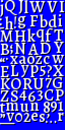

# TTF Example

This is a subset of the [Alegreya Medium][alegreya] font, rendered at size 16. The build scripts and data used to create this example are in the [examples/font_ttf][font_ttf] folder.

[alegreya]: https://fonts.google.com/specimen/Alegreya
[font_ttf]: https://github.com/depp/skelly64/tree/main/examples/font_ttf

<figure>
  
  <figcaption>The packed textures</figcaption>
</figure>

!!! note

    Missing documentation—how was this created?
